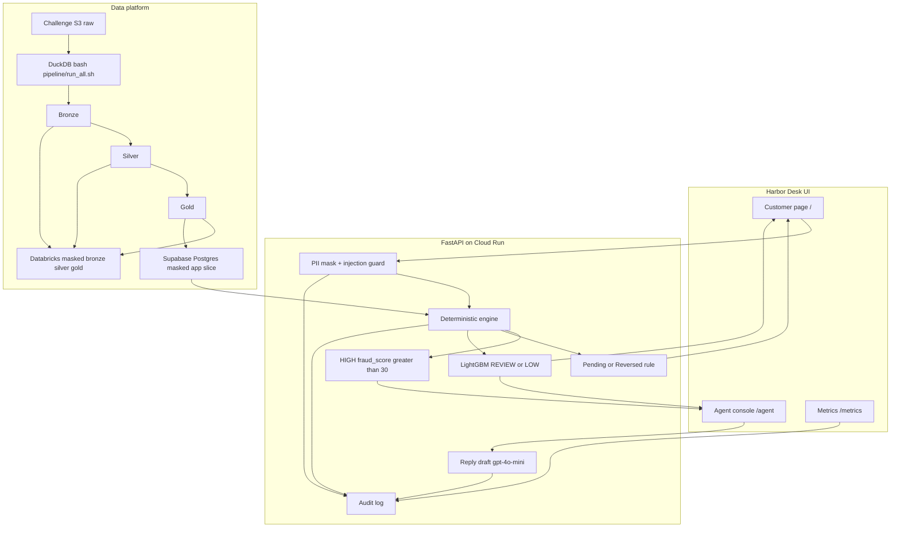
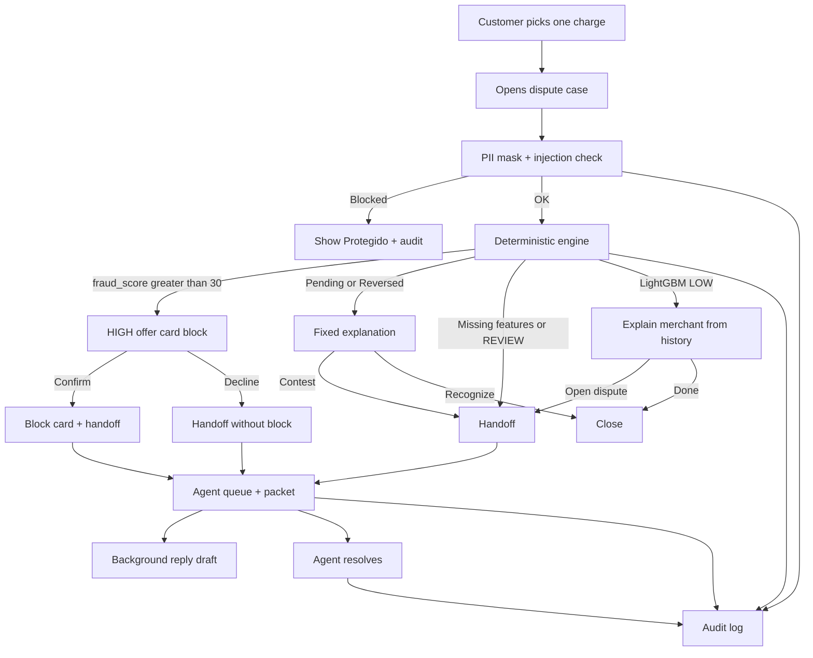
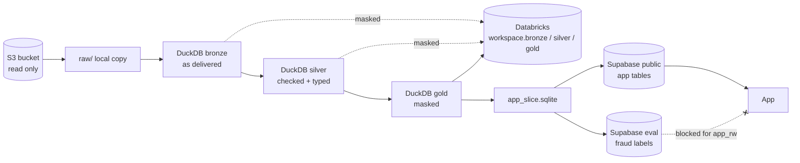

# Harbor Desk: step-by-step guide

Use this guide to understand, run, deploy, test and explain the Factored AI & Data Hackathon 2026 entry, `jaime-sql/factored-hackathon-2026-databank_sv`.

**Live URL:** https://databank-sv-app-285047339740.us-central1.run.app (details in section 6.4). For the reasons behind each choice, see [`docs/decisions.md`](decisions.md).

---

## 0. What the system does

1. A customer at a LATAM card bank (Mexico, Colombia, Argentina) picks one charge and says "no reconozco este cargo".
2. Before anything is stored, guardrails mask PII and block prompt injection.
3. A deterministic engine routes the charge: **HIGH** (offer a card block), the **Pending/Reversed rule path** (fixed explanation), or LightGBM **REVIEW** (send to a human) or **LOW** (explain and auto-close).
4. Handoffs go to a human agent console with a verified packet and a background `gpt-4o-mini` reply draft. A human always sends the reply. The assistant never moves money.
5. Every step goes to an append-only audit log, which feeds the Métricas page.

---

## 1. Architecture



**Stack.** One FastAPI container on **Cloud Run** (service `databank-sv-app`, project `databank-sv-123456`, region `us-central1`). Data lives in **Supabase Postgres** (project `dmqwgbtrrnxkgcahunrc`). The app connects as role `app_rw`, which can read the public data tables, can't write to them, and can't access `eval`. **OpenAI `gpt-4o-mini`** has one job: it phrases the reply draft for a human agent. The deterministic engine makes every decision. With no `DATABASE_URL`, the app runs on local SQLite (`data/bank.sqlite`, `data/ops.sqlite`), built from the synthetic fixture.

There is no tool-calling LLM agent. The only LLM call is the background reply draft. Routing and the customer's replies come from fixed rules and templates.

**Folders**

| Path | What it does |
|---|---|
| `app/main.py` | App factory. Picks Postgres or SQLite, loads thresholds and the LightGBM model, and serves `/`, `/agent`, `/metrics` and `/static`. |
| `app/api/routes.py` | All HTTP endpoints: personas, session, test mode, transactions, cases and case actions, handoff queue (packet, draft, draft check, reply, resolve), metrics, audit export, health. |
| `app/cases/engine.py` | The deterministic engine: guardrails, routing, customer actions, handoff, reply draft, and audit rows. |
| `app/guardrails/` | `pii.py` masks identifiers, `injection.py` blocks prompt injection, `draft_check.py` checks that a draft is grounded. |
| `app/thresholds_loader.py`, `app/triage_model.py`, `triage/` | Routing order and the vendored LightGBM booster (`triage/artifacts/model.txt`, `thresholds.json`). |
| `app/handoff/` | The handoff packet (`packet.py`) and the queue card and packet view in the console (`present.py`). |
| `app/reply/draft.py` | Builds the customer-language reply draft from packet facts only. It uses the template, or OpenAI with the template as fallback. |
| `app/bank/` | Read-only bank data access (`repository.py`, `access.py`) and the SQLite fixture (`fixture.py`). |
| `app/ops/store.py` | Operational tables in schema `app`: cases, handoff, audit, LLM calls, test cases. Audit rows are append-only. |
| `app/metrics/compute.py`, `app/panels.py` | Métricas aggregates, plus optional JSON panels from `static/data/` (`trust.json`, `sim_curve.json`, `fairness.json`). |
| `app/auth/session.py` | Signed customer session cookie (`hd_session`), test marker cookie (`hd_test`), and agent roles (admin / judge). |
| `app/i18n.py` | ES/PT copy catalog served to the pages. |
| `static/` | The pages: `index.html` + `js/desk.js` (customer), `agent.html` + `js/agent.js` (console), `metrics.html` + `js/metrics.js`, `js/tour.js` (the "¿Cómo funciona?" guide). |
| `migrations/` | SQL `001`–`006` for the `app` schema. |
| `deploy/cloudrun.sh`, `Dockerfile` | Container build and the tag deploy script for `databank-sv-app` (no traffic, see section 6.2). |
| `scripts/mark_demo_cases_test.py` | Marks existing case ids as test traffic. |
| `pipeline/` | The data pipeline (section 3). |
| `ml/` | The ML code and artifacts (section 4). |
| `analytics/` | The metric and cost scripts (section 5). |

**Pages**

- **Cliente `/`**: personas, charges, chat box, **Intenta romperlo**, a "¿Por qué?" panel (local time, band, reason), the **Modo de prueba** link, and **Demos rápidas**: three one-click demo charges (high risk, doubtful charge, pending charge). Demo-button cases are sent with `demo_case: true`; the server honours that flag only for those three charges and stores them as test traffic, so they stay out of Métricas.
- **Consola `/agent`**: token, **Ver cola**, queue cards, packet, AI draft, **Resolver**.
- **Métricas `/metrics`**: case, handoff, containment and eval-excluded tiles, plus **Salud del sistema** (calls, latency, cost), **Confianza de los datos**, the **Simulador de umbral**, **Equidad**, and the raw JSON. The source is `GET /api/metrics`, which is public, returns aggregates only, and excludes eval traffic by default.
- On every page, `#lang` switches ES↔PT (saved in `localStorage.hd_lang`), and `#tour` opens "¿Cómo funciona?".

Health: `GET /health` returns `status`, `bank`, `ops`, `llm` and `migrations_ok`. On Cloud Run, probe `/health`, not `/healthz`, because the run.app front end reserves `/healthz`.

---

## 2. A dispute, end to end



### Step by step

1. **Public chat (`/`).** The customer picks a persona (`POST /api/session` sets a signed `hd_session` cookie), sees their charges (`GET /api/transactions`), and disputes one (`POST /cases`).
2. **Guardrails, before anything is stored.** `pii.py` masks direct identifiers such as emails, phones, IDs, account numbers and card numbers, and flags `pii_masked`. `injection.py` blocks attempts like "ignora tus reglas…". A blocked turn is refused, the page shows **Protegido**, and the audit row records `prompt_injection`. The **Intenta romperlo** button sends the same demo attack (`demo_attack=true`).
3. **Routing, always in this order** (`preliminary_route` + `Engine._route`):
   1. **HIGH** if `fraud_score > 30`. This check runs first, for any status. A missing score is never HIGH. The desk offers a card block. Only `confirm_block` performs it. `confirm_block` and `decline_block` both hand off to a person.
   2. **Rule path**: Pending or Reversed charges that are not HIGH. A fixed explanation plus "Sigo sin reconocer este cargo" (`contest`), which hands off with `customer_contests_rule_answer`.
   3. **LightGBM** for Approved / Declined charges that are not HIGH, using the raw score against `t_low` = `0.000275603870032301` (from `thresholds.json`):
      - **REVIEW**: raw score ≥ `t_low`, or no feature row, or a model error or fallback. The case goes straight to handoff with no block. A missing feature row is never LOW.
      - **LOW**: raw score < `t_low`. The desk explains the merchant (or a synthetic duplicate). The customer can answer `recognize` (the case closes as auto-resolved) or `open_dispute` (handoff).
   - Each state allows only certain actions (`_ALLOWED`). Any other action returns 403 and is flagged `unauthorized_access`. The assistant never moves money.
4. **Handoff queue.** The engine stores a packet in `app.handoff`. The packet has the verified facts (band, amount, masked merchant, local time, reason) and no raw customer text.
5. **Agent console (`/agent`).** The agent enters a token and clicks **Ver cola** (`GET /api/handoff`), then **Abrir paquete** (`GET /api/handoff/{id}`). The admin token is `DEMO_AGENT_TOKEN`. The judge token, `DEMO_JUDGE_TOKEN`, can only list, open and resolve the queue.
6. **AI draft (stored, sent by a human).** After the customer response returns, a background task writes `reply_draft` on the case and appends a `reply_draft` audit row. When OpenAI is used, it also appends an `app.audit_llm_call` row with tokens and latency. The console shows **Borrador IA** with a grounded badge ("Borrador en preparación…" until it's ready). As the agent edits, `POST /api/handoff/{id}/draft-check` re-checks that every amount, date and merchant token appears in the packet. Nothing reaches the customer until the agent clicks **Revisar y enviar (agente humano)** (`POST /api/handoff/{id}/reply`). Each case can be sent once (a second send returns 409).
   - While the draft is pending, the console polls `GET /api/handoff/{id}/draft`, which writes no audit rows. After 40 s it shows "No se pudo generar el borrador" with a **Reintentar** button (`POST /api/handoff/{id}/draft/retry`), and the retry sends only one request.
7. **Resolver.** `POST /api/handoff/{id}/resolve` marks the handoff resolved, with an optional note.
8. **Audit log.** Every step appends to `app.audit_case`, `app.audit_event` and `app.audit_llm_call`. Corrections use `supersedes_audit_id`, and nothing is updated or deleted. Opening the console, the draft and resolving add `console_*` rows, with `source='judge'` for the judge token. `app.audit_current` is the unfiltered tip and is what the eval runner reads. `app.audit_live` excludes test, eval and demo-attack rows and feeds Métricas. `GET /audit/export` (admin only) downloads the CSV.

Times shown to the customer and in the packet are `transaction_ts_utc` converted with `customers.tz`. `is_fraud` is never read by the app.

---

## 3. Data

**Platform:** DuckDB builds every layer locally with one command. Masked copies of bronze, silver and gold sit in Jaime's Databricks. The app reads a small masked slice from Supabase Postgres.



### 3.1 What the data is

- **Source:** `s3://factored-datathon-2026-s3-157725502942-us-east-2-an/data/`. We copy it to `raw/` and only read from it. No pipeline step writes to S3.
- **The three tables the pipeline uses:**

| Table | Files | Rows |
|---|---|---|
| transactions | 1,097 daily CSVs | 4,425,008 |
| customers | 1 CSV | 150,000 |
| products | 1 CSV | 400,000 |

The bucket has other tables too, such as complaints and call transcripts. They're profiled in [`docs/data-quality.md`](data-quality.md) but not used in the pipeline.

### 3.2 The three layers

DuckDB builds every layer locally, in `cache/pipeline.duckdb`.

| Layer | What it holds |
|---|---|
| **Bronze** | The raw CSVs exactly as delivered (all text), plus the source file name and load time. |
| **Silver** | The same data, checked against a schema contract, typed, with countries normalized and duplicates removed (0 found), plus UTC and local timestamps. |
| **Gold** | Masked data: raw IDs become salted keys (`CUS_…`, `PRD_…`, `TXN_…`), and personal data is dropped. It also has the fraud-model table (`fraud_features`, 4,291,915 rows, with Pending and Reversed charges left out) and the train/val/test split. |

**Masked copies in Jaime's Databricks.** Each `count(*)` matches the local run:

| Schema | Tables and rows |
|---|---|
| `workspace.bronze` | transactions_masked 4,425,008 · customers_masked 150,000 · products_masked 400,000 |
| `workspace.silver` | the same three tables and counts, plus run_log 1 |
| `workspace.gold` | transactions_masked 4,425,008 · customers_masked 150,000 · fraud_features 4,291,915 · fraud_splits 4,291,915 · synthetic_duplicates 600 |

- **Dropped:** names, document number and type, date of birth, gender, email, phones, address, city, state, postal code, product number, and exact latitude/longitude.
- **Pseudonymized:** customer, product and transaction IDs become the same salted keys as gold, so all layers still join. The salt stays in `.env` and is never uploaded.
- **Upload gate:** before upload, every file is scanned in full. The upload stops on any PII column, raw ID, email, phone, document number, name or local path.
- **Unmasked bronze and silver never leave the local machine.**

### 3.3 Where the app data goes (Supabase)

`load_supabase.py` loads a small slice built from gold: `app_slice.sqlite`, with 1,091 customers.

- **`public` (what the app reads):** `customers` 1,091 · `transactions` 40,322 (no fraud label) · `fraud_features` 38,910 · `synthetic_duplicates` 600 · `meta` 4.
- **`eval` (the answers):** `eval.transaction_labels` has 40,322 rows, of which 261 are fraud. The app's role, `app_rw`, gets "permission denied" there, so the app can never see the labels.
- Row-level security is on for every table.

### 3.4 Rerun everything with one command

From the repo root:

```bash
bash pipeline/run_all.sh                # bronze → silver → gold → app slice → tests → parquet export
bash pipeline/run_all.sh --databricks   # same, plus loading the masked copies into Databricks
```

- **Env vars (names only):** `PSEUDO_SALT` goes in `./.env` and is always needed. `DATABRICKS_TOKEN` is needed only for `--databricks`, and `DATABRICKS_HOST` is optional. `SUPABASE_DB_URL` is needed only for the separate Supabase load.
- **Time:** about 1.5–2 minutes for a full run.
- **Tests** run inside the script, which stops on the first failure:
  - `test_leakage`: no future data in training, the model features match the allow-list, and the split hashes recompute.
  - `test_isolation`: each customer only ever sees their own rows, and forged or injected keys are rejected.
  - `test_pii`: no PII anywhere in gold, the exports or the app slice.
- When every step passes, the script writes `out/last_run.json` with the finish time, duration and row counts.
- **Python env:** with `uv` installed, the script runs every step with `uv run --no-project --python 3.12 --with-requirements pipeline/requirements.txt`. Without `uv`, it creates `.venv` with `python3 -m venv` and installs `pipeline/requirements.txt` there.
- **Supabase load (separate, optional):** `SUPABASE_DB_URL` must be exported.

  ```bash
  .venv/bin/python pipeline/load_supabase.py --dry-run   # counts + PII scan only
  .venv/bin/python pipeline/load_supabase.py             # schema, load, verify counts and RLS
  ```

  `.venv` exists only if `run_all.sh` ran without `uv`. With `uv`, use `uv run --no-project --python 3.12 --with-requirements pipeline/requirements.txt python pipeline/load_supabase.py [--dry-run]` instead.

### 3.5 Trust checks (the "Confianza de los datos" box on Métricas)

From the repo root, with both connection strings exported (never commit them): `SUPABASE_DB_URL` (owner connection: counts, RLS, privilege catalog) and `APP_DB_URL` (`app_rw` connection: eval-isolation probe).

```bash
export SUPABASE_DB_URL='postgresql://...'   # owner
export APP_DB_URL='postgresql://...'        # app_rw
uv run -q --no-project --python 3.12 --with-requirements pipeline/requirements.txt \
  python pipeline/trust_check.py            # writes static/data/trust.json (use --out PATH to write elsewhere)
```

The last run (2026-10-03 10:33 CST) passed 6 of 6:

| # | On screen (ES) | What it proves |
|---|---|---|
| 1 | Tablas que cuadran con la fuente del pipeline: 6/6 | Supabase row counts equal the pipeline output for all 6 tables. |
| 2 | Etiquetas de evaluación aisladas de la app: OK | The app's role gets "permission denied" on the fraud labels. |
| 3 | Seguridad por fila (RLS) activa en todas las tablas: 17/17 | Row-level security is on for every table in `public`, `eval` and `app`. |
| 4 | Auditoría solo admite inserciones: OK | The app can add audit rows but never change or delete them. |
| 5 | La app solo lee los datos públicos: OK | The app has no write rights on any `public` table. |
| 6 | Reproducible con un comando: bash pipeline/run_all.sh | The one-command runner and pinned requirements exist. After a full run, this line also shows the last run time. |

**How `trust.json` reaches the screen.** The file holds these 6 lines in Spanish and Portuguese, each with an ok flag and `checked_at`. The app reads `static/data/trust.json` and returns it with `/api/metrics`. Métricas draws one line per check: ● when it passes, ○ when it fails. If the file is missing, the box stays hidden. The file is built into the app image, so a new check shows up only after it's committed and the app is redeployed. The time on screen comes from `checked_at`.

---

## 4. ML and evaluation

### 4.1 How a charge is routed (checked in this order)

1. **HIGH** if `fraud_score > 30`. This check runs first, for any status. A missing score is never HIGH. HIGH offers a card block, the customer confirms, and a human takes over.
2. **Pending / Reversed** charges that are not HIGH go to the **deterministic rule path** (handled automatically).
3. **Approved / Declined** charges that are not HIGH are scored by LightGBM (raw score):
   - score ≥ `t_low` (0.000275603870032301) → **REVIEW** (a human handles it, no block)
   - score < `t_low` → **LOW** (the agent explains and can auto-close)

### 4.2 Thresholds and why

- HIGH is a fixed rule, not a model. On TEST the rule ties the model, and it's easy to explain.
- HIGH is strictly `> 30`, not `>= 30`. On test, `>= 30` would have blocked 88 legitimate charges (see `docs/decisions.md` §3).
- `t_low` is the highest cut that keeps at least 95% of all VAL fraud out of LOW. It was **chosen on validation only**.
- TEST was **frozen and run once** (09:15 CST, Oct 3), with a marker that blocks a second run. MLflow run `6b8156af68a440988e2ff36640aca29b`. Nothing was tuned on TEST.

### 4.3 How to read the results

- **PR-AUC (TEST, Approved/Declined):** LightGBM 0.5840, rule 0.5833, logreg 0.5760. LightGBM − rule = **+0.0007, 95% CI [−0.0007, +0.0019]**. The CI includes 0, so this is a **tie**. That's why the rule owns HIGH and the model only splits LOW from REVIEW. Never say the model beats the rule.
- **HIGH (TEST):** all 334 Approved/Declined charges flagged were fraud (334/334). Pending/Reversed: 4 HIGH, all fraud. **0 wrongful blocks.**
- **Missed fraud** (fraud in LOW / all fraud):
  - VAL 29/610 = **4.75%** (Wilson 95% CI 3.33–6.74%)
  - TEST 29/583 = **4.97%** (3.49–7.05%). The threshold carried over to TEST.
- **Automation** ((rule + LOW) / all charges): **18.01% VAL / 16.03% TEST**. On TEST, scores drift slightly upward, so LOW shrinks.
- **Wrongful auto-close has two measures. Always say which one you mean.**
  - **0.437 per 10k** = fraud in LOW only, 29 / 663,624 VAL charges (`wrongful_autoclose_per_10k` in `sim_curve.json`).
  - **0.53 per 10k** = the T4 tile in the app. It also counts the 6 VAL frauds on the rule path: (29 + 6) / 663,624. The tile carries this label.
- **Fairness:** Mexico is a known gap ("Brecha conocida"). Validation misses: Mexico 21/292 (7.2%), Colombia 4/181, Argentina 4/137. Per-country cuts are future work (`docs/decisions.md` §5).

### 4.4 Where to find things in the repo

- `ml/`: code (`triage/`, `scripts/`, `evals/run_test_eval.py`) and `ml/artifacts/test_results.json` (raw TEST output)
- [`docs/evaluation.md`](evaluation.md): the full write-up. `docs/evaluation_test.md`: the auto-generated TEST tables
- `static/data/sim_curve.json`: the VAL threshold curve the app's simulator reads

---

## 5. Metrics

**Rule:** the deck and docs quote only the locked offline numbers below, never the live Métricas tiles. The live page shows demo and QA traffic. The `audit_live` snapshot will be taken on Oct 5, before the submission email goes out. It is demo-seeded, so it is shown only with its n.

### 5.1 Locked headline numbers

| Number | Value | Split |
|---|---|---|
| Automation (rule + LOW) / all charges | **18.01%** (19,832 + 99,708) / 663,624 | validation |
| Automation, check only | 16.03% | test |
| Missed fraud (fraud in LOW / all fraud) | **29 / 610 = 4.75%** (Wilson 95% CI 3.33–6.74%) | validation |
| HIGH (fraud_score > 30) | **330 charges, all 330 fraud** | validation |
| PR-AUC, model vs rule | 0.584 vs 0.583: **a tie.** Never say the model wins. | test |
| Fraud closed without a human, per 10k charges | **0.53** = (29 + 6) / 663,624 × 10,000 | validation |
| Cost per charge (mid scenario) | **$2.72 vs $3.32** human-only: saves **$0.60 (18.0%)** | validation, projection |

The test split is a check only. It never feeds the curve or the thresholds.

### 5.2 The Métricas page, block by block

**Live tiles** come from `audit_live`, so they show demo traffic, not results:
- **Casos:** cases counted in the current window. Eval traffic, test traffic and "Intenta romperlo" attacks are left out.
- **Traspaso a persona:** closed cases handed to a human, shown as k / n.
- **Contención:** closed cases that were not handed off, shown as k / n.
- **Evaluación excluida / Prueba excluida:** how many eval and test cases were dropped from the counts above.
- **Salud del sistema:** LLM calls, p50 and p95 latency, and mean cost per call in this window.
- **Confianza de los datos:** the Data Engineer's pass/fail checks from `trust.json` (section 3.5).

**Static panels** come from shipped files built on the validation set, not live traffic:
- **Simulador de umbral** (`static/data/sim_curve.json`): a slider that moves only the LOW/REVIEW cut. The HIGH rule and the Pending/Reversed rule path never move. It renders only when the file exists.
  - **Automatización:** (rule + LOW) / all charges. 18.01% at the default cut.
  - **Bajo / Revisión:** how many charges the AI closes and how many go to a person.
  - **Fraude no visto (with CI):** fraud that lands in LOW out of all 610 fraud. 29/610 at the default cut.
  - **T4, "Fraudes cerrados sin revisión humana, por 10k cargos (incluye pendientes y revertidos)":** (missed fraud k + fraud on the rule path) / charges × 10,000. 0.53 at the default cut. The app computes it.
  - **Riesgo alto / Fraude en riesgo alto / Regla / Fraude en la regla:** fixed counts of 330, 330, 19,832 and 6.
  - **Costo por caso:** three scenarios (low / mid / high), always labeled PROYECCIÓN.
- **Equidad** (`static/data/fairness.json`): one row per customer country.
  - **Razón de derivación:** that country's REVIEW share ÷ the overall REVIEW share, on Approved/Declined charges only, on validation. 1.00× = average. **Mexico 0.96×, Colombia 1.05×, Argentina 1.01×**.
  - **Fraude no visto** per country, with a 95% CI: Mexico 21/292, Colombia 4/181, Argentina 4/137. Mexico has the "Brecha conocida" chip and a cause note.

### 5.3 How to recompute

Setup: Python 3.12 venv (the repo's `.python-version`), then `pip install duckdb pandas matplotlib`. The fairness script also needs `pyarrow`, `lightgbm==4.7.0` and `pytz`. Env vars: `BANK_DUCKDB_PATH` (the raw DuckDB file), `PIPELINE_DUCKDB_PATH` (the gold tables), `HACK_ML_ARTIFACTS` (`model.txt`, `feature_list.json`, `category_mappings.json`, `thresholds.json`, `val_results.json`; `test_results.json` for the test numbers), `SPLITS_MANIFEST_PATH`.

| Number | Command | Reads |
|---|---|---|
| Automation, missed fraud, HIGH, T4 | ML Engineer's curve: `static/data/sim_curve.json` (default point: `default: true`) | T4 = `(points[default].missed_fraud.k + fraud_in_rule) / n_charges * 10000` |
| Test PR-AUC, test automation | `test_results.json` → `compare.models.{lightgbm,rule_fraud_score}.pr_auc`, `extensions.routing_split.automation_rate` | ML artifacts |
| Cost per case | `python analytics/simulator_cost.py --llm-cost-json eval_cost.json --in-place` (or `--out FILE`). Other flags: `--curve` (default `static/data/sim_curve.json`), `--llm-cost-usd X`, `--rule-path-llm-cost` (default 0), `--note` | `sim_curve.json`, `eval_cost.json` |
| Fairness / Razón de derivación | `python analytics/fairness.py --routing-split <ML routing split>.json --ship` (`--out` to write elsewhere). It refuses to ship unless its reproduction gates pass and the routing split's totals match its own reproduction. `--no-shares --ship` writes a reduced file with no band shares. | pipeline DuckDB, ML artifacts, splits manifest |
| Human cost per resolution ($1.66 / $3.32 / $5.53) | `cd analytics && python cost_projection.py` → `out/cost_proj_per_resolution.csv` | `BANK_DUCKDB_PATH` |
| Demand and case mix (background charts) | `python demand_metrics.py`, `python dispute_case_mix.py` | DuckDB (+ ML artifacts) |

### 5.4 Cost per case

- **Formula, per charge:** LOW = $0 (no LLM call, no human). REVIEW and HIGH = one LLM call ($6.52e-5) + one human resolution. Rule path = $0. Human-only = one human resolution per charge.
- **LLM cost:** $6.52e-5 per call, the mean of 22 QA audit rows at $0.15 / $0.60 per 1M tokens.
- **Mid scenario ($12/h):** **$2.72 vs $3.32**, saving **$0.60 (18.0%)**. The low and high scenarios save **$0.30** and **$1.00** (both 18.0%).
- **Why the saving ≈ the automation rate:** the LLM costs fractions of a cent, so almost all of the saving comes from the human work the AI removes.

Details: [`docs/analytics.md`](analytics.md).

---

## 6. Run locally, deploy, test

### 6.1 Run it locally

Requirements: `uv`, Python 3.12, Node (for the JS tests), and `libgomp1` on Linux (needed by LightGBM).

```bash
git clone https://github.com/jaime-sql/factored-hackathon-2026-databank_sv
cd factored-hackathon-2026-databank_sv
uv sync --all-groups
make dev                       # uvicorn app.main:app --reload on port 8091 (PORT=... to change)
```

Open http://127.0.0.1:8091 (also `/agent` and `/metrics`). By default the app uses SQLite, needs no API key, and uses template drafts. The local queue starts empty, so open a case on `/` first. Docker alternative: `docker compose up` serves on port 8091.

**Env vars** (names only, as read by `app/config.py`; optional `.env`, never commit it):
`ENVIRONMENT`, `PORT`, `LOG_LEVEL`, `BANK_DISPLAY_NAME`, `LLM_PROVIDER` (`template`|`mock`|`openai`|`openrouter`; empty = `openai` if `OPENAI_API_KEY` is set, else `openrouter` if `OPENROUTER_API_KEY` is set, else template), `OPENAI_API_KEY`, `OPENAI_MODEL` (default `gpt-4o-mini`), `OPENAI_BASE_URL`, `OPENROUTER_API_KEY`, `OPENROUTER_MODEL`, `OPENROUTER_BASE_URL`, `LLM_TIMEOUT_SECONDS`, `LLM_MAX_RETRIES`, `DATABASE_URL` (empty = SQLite), `BANK_DB_PATH`, `OPS_DB_PATH`, `THRESHOLDS_PATH`, `SESSION_SECRET`, `SESSION_TTL_HOURS`, `DEMO_AGENT_TOKEN`, `DEMO_AGENT_EMAIL`, `DEMO_JUDGE_TOKEN`, `EVAL_RUNNER_TOKEN`, `QA_TEST_TOKEN`, `CLERK_SECRET_KEY`, `CLERK_PUBLISHABLE_KEY`, `PROMPT_VERSION`. `APP_ROOT` (read in `app/paths.py`) overrides the app root folder.

`.env.example` also lists `INPUT_COST_PER_MILLION`, `OUTPUT_COST_PER_MILLION`, `MAX_AGENT_STEPS`, `HANDOFF_CONFIDENCE_THRESHOLD`, `HANDOFF_RISK_THRESHOLD` and `DISPUTE_WINDOW_DAYS`. The app does not read them. `QA_TEST_TOKEN` is read but not listed there.

Rules: `DEMO_JUDGE_TOKEN` must differ from `EVAL_RUNNER_TOKEN`, or startup fails. With `ENVIRONMENT=production`, the app requires `DATABASE_URL`, a non-default `SESSION_SECRET` of at least 32 characters, and a non-default `DEMO_AGENT_TOKEN` of at least 16 characters (or Clerk keys).

**Lint, format, types, tests:**

```bash
make lint        # ruff check . && ruff format --check .
make format      # ruff format . && ruff check --fix .
make typecheck   # mypy app
env -u OPENAI_API_KEY NODE_OPTIONS=--experimental-websocket uv run pytest
```

`make check` runs lint, typecheck and test together. `OPENAI_API_KEY` must be unset for tests. `NODE_OPTIONS=--experimental-websocket` is needed on Node 20 for the WebSocket used in `tests/test_guide_nav.py`. Browser tests skip when Chrome or Chromium isn't installed. Pre-commit runs ruff (`.pre-commit-config.yaml`).

### 6.2 Deploy

The live service runs a pre-built image from Artifact Registry `us-central1-docker.pkg.dev/databank-sv-123456/databank-sv/app:<git-sha>`. New revisions deploy with no traffic, behind a tag. Live traffic is **pinned to one revision** and moves only when someone runs `update-traffic`.

```bash
SHA=$(git rev-parse --short HEAD)
IMAGE=us-central1-docker.pkg.dev/databank-sv-123456/databank-sv/app:$SHA

# 1) Build (Cloud Build, uses the repo Dockerfile)
gcloud builds submit . --project databank-sv-123456 --region us-central1 --tag "$IMAGE"

# 2) Deploy a revision with 0% traffic behind a tag (next = staging, preview = PR preview)
gcloud run deploy databank-sv-app --project databank-sv-123456 --region us-central1 \
  --image "$IMAGE" --no-traffic --tag next
#   -> https://next---databank-sv-app-4oixi2h3ua-uc.a.run.app
#   (preview tag: https://preview---databank-sv-app-4oixi2h3ua-uc.a.run.app)

# 3) Inspect revisions and current traffic
gcloud run revisions list --service databank-sv-app --project databank-sv-123456 --region us-central1
gcloud run services describe databank-sv-app --project databank-sv-123456 --region us-central1 \
  --format='yaml(status.traffic)'

# 4) Promote: pin 100% of live traffic to the tested revision (rollback = same command, old revision)
gcloud run services update-traffic databank-sv-app --project databank-sv-123456 --region us-central1 \
  --to-revisions <REVISION>=100

# Move a tag without touching live traffic
gcloud run services update-traffic databank-sv-app --project databank-sv-123456 --region us-central1 \
  --update-tags preview=<REVISION>
```

If `builds submit` says it can't stream logs, the build is still running in Cloud Build. Check it in the Cloud Build console before deploying.

A `--image` deploy keeps the env and secrets from the previous revision. The service sets `ENVIRONMENT=production`, min 1 and max 4 instances, startup CPU boost, and these Secret Manager mappings (secret name → env var, always `:latest`):

| Secret | Env var |
|---|---|
| `qa-test-token` | `QA_TEST_TOKEN` |
| `demo-judge-token` | `DEMO_JUDGE_TOKEN` |
| `admin-token` | `DEMO_AGENT_TOKEN` |
| `eval-runner-token` | `EVAL_RUNNER_TOKEN` |
| `database-url` | `DATABASE_URL` (`app_rw` connection string) |
| `session-secret` | `SESSION_SECRET` |
| `openai-api-key` | `OPENAI_API_KEY` |

To change a mapping, add `--update-secrets QA_TEST_TOKEN=qa-test-token:latest` (etc.) to the deploy. Never put a value on the command line or in the repo.

> `deploy/cloudrun.sh [TAG] [GIT_REF]` runs the build and the no-traffic tag deploy above in one step (default tag `next`, default ref `origin/main`). Tag deploys set `FORCE_TEST_CASES=true`, so every case they create is test traffic; the script refuses to deploy without a tag and never moves traffic. Promote with the `update-traffic` command above, from a revision deployed without the flag.

**DB migrations** (Supabase `dmqwgbtrrnxkgcahunrc`). Apply them as the **database owner**, not `app_rw`, in order. Each file is idempotent.

```bash
psql "<owner connection string>" -v ON_ERROR_STOP=1 -f migrations/001_app_schema.sql
# ...then 002_is_test, 003_view_grants, 004_demo_attack, 005_readonly_reference, 006_judge_source
```

- The app never runs `001`, `005` or `006`. The owner must apply them.
- `002`, `003` and `004` run at startup only if the role is allowed. A refusal is logged and the app stays up, so apply them as the owner anyway.
- After a migration, check `GET /health`. `migrations_ok: true` means the test-traffic schema (`is_test`, `app.test_cases`, `app.audit_live`) exists.
- The public data tables (transactions, `fraud_features`, customers) come from the data pipeline (section 3).

### 6.3 Test it

**Unit and CI.** `.github/workflows/ci.yml` runs on every push and PR with `LLM_PROVIDER=mock` on Python 3.12: install `libgomp1` → `uv sync --frozen --all-groups` → `ruff check` → `ruff format --check` → `mypy app` → `pytest`. Run the same thing locally with the commands in 6.1.

**Live smoke check.** Run it on the `next`/`preview` tag URL before promoting, then on live:

1. `curl -s <URL>/health` should return `{"status":"ok","bank":"postgres","ops":"postgres","llm":"openai","migrations_ok":true}`.
2. `/`, `/agent` and `/metrics` each return 200 and render.
3. On `/`, choose a persona and dispute a charge. Check the reply, the band, and "¿Por qué?". Press **Intenta romperlo** and look for **Protegido**.
4. On `/agent`, enter a token, click **Ver cola**, and open the packet. The **Borrador IA** draft appears (it may say "Borrador en preparación…" for a few seconds). Edit it, send it once, then **Resolver**.
5. On `/metrics`, the tiles and **Salud del sistema** load.
6. **Language toggle on every page (`/`, `/agent`, `/metrics`): ES → PT → ES.** Click `#lang`. The button reads **Español → Português → Español**, and the copy follows. Examples: "¿Cómo funciona?" ↔ "Como funciona?", Consola ↔ Console, Ver cola ↔ Ver fila, MODO PRUEBA ↔ MODO TESTE. Reload and check that the choice persists (`hd_lang`).

**Test mode** keeps QA and demo traffic out of the KPIs. It works only when `QA_TEST_TOKEN` is set.

- API: send the header `X-Test-Token: <QA token>` on `POST /api/session` or `POST /cases`, or `POST /api/test-mode` with that header.
- Browser: on `/`, click **Modo de prueba**, paste the token in **Token de prueba**, then **Activar**. The header shows **MODO PRUEBA** (PT **MODO TESTE**), and console cards show a **Prueba** chip.
- The token is never read from the URL and never echoed back. A wrong token gets a normal 200 with the flag off. Once armed, the `hd_test` cookie marks the rest of that browser session, and new cases are stored with `is_test=true` at insert time. Eval-runner cases never set `is_test`.
- Métricas and `/audit/export` read `app.audit_live`, which leaves test rows out. Only the admin token with `include_test=1` / `include_eval=1` brings them back.

**Marking cases created before test mode existed.** Insert their ids into `app.test_cases`. This is insert-only and leaves audit rows untouched. Run it with `DATABASE_URL` exported:

```bash
uv run python -m scripts.mark_demo_cases_test <case-id> [<case-id> ...]
uv run python -m scripts.mark_demo_cases_test --before 2026-10-01T00:00:00Z   # skips cases with eval_run_id
```

The script prints how many rows it inserted. Running it again inserts nothing for ids already there.

### 6.4 Live URL

**https://databank-sv-app-285047339740.us-central1.run.app** (`/`, `/agent`, `/metrics`, `/health`)

As of Oct 3, live serves revision `databank-sv-app-00029-fin` (main `f3af22d`, PR #5 merged) at 100% traffic, with `00012-qm7` kept for rollback.

Staging tag (QA builds): https://next---databank-sv-app-4oixi2h3ua-uc.a.run.app. Check which revision live serves with the `services describe` command in 6.2.

---

## 7. Demo walkthrough

Do this in one browser session, in order. Have two tokens ready (values come from Secret Manager, never from this doc): the QA test token (`qa-test-token`) and an agent token for Consola (`admin-token`, or `demo-judge-token` for judge-only access). The QA test token alone does not open Consola on the production service.

1. **Turn on test mode.** On `/`, click **Modo de prueba**, paste the test token in **Token de prueba**, click **Activar**. Check that the header shows **MODO PRUEBA**. Now nothing you do counts in Métricas.
2. **Pick a persona.** Choose a customer pill (for example **Ana · Rosario**). Their charges load.
3. **Dispute a charge.** Pick one charge and send **"no reconozco este cargo"**. Show the reply, the band, and the **¿Por qué?** panel (local time, band, reason).
4. **If the band is HIGH**, the desk offers a card block. Click to confirm it. Explain: the block happens only after the customer confirms, and both confirm and decline hand off to a person. If the band is the rule path or LOW, show the fixed explanation or the merchant explanation instead.
5. **Check Consola.** Open `/agent`, enter the agent token, click **Ver cola**, then **Abrir paquete**. Point out the verified facts in the packet (no raw customer text), the **Prueba** chip, and the **Borrador IA** draft with its grounded badge. Edit the draft, click **Revisar y enviar (agente humano)** once, then **Resolver**.
6. **Try "Intenta romperlo".** Back on `/`, press **Intenta romperlo**. The page shows **Protegido**. The attack is refused and logged as `prompt_injection`, and it's left out of the metrics.
7. **Open Métricas.** On `/metrics`, walk through the tiles, **Salud del sistema**, **Confianza de los datos** (6 checks), the **Simulador de umbral** (move the slider: only the LOW/REVIEW cut moves), T4 = 0.53, the cost line, and **Equidad** with Mexico's "Brecha conocida". When you quote numbers, use the locked numbers in 5.1, not the live tiles.
8. Optional: switch ES → PT → ES with `#lang`, and open **¿Cómo funciona?** with `#tour`.
9. Optional, no token needed: the **Demos rápidas** buttons on `/` open the three demo charges (high risk, doubtful, pending) in one click. They are stored as test traffic, so they never reach Métricas.

---

## 8. Troubleshooting

| Symptom | Cause / fix |
|---|---|
| Local queue in Consola is empty | Expected on SQLite. Open a case on `/` first, then **Ver cola**. |
| `/healthz` returns 404 on Cloud Run | The run.app front end reserves `/healthz`. Use `/health`. |
| `/health` shows `migrations_ok: false` | Apply migrations `001`–`006` as the database owner (6.2). Until then, test marks are ignored and metrics read `audit_current`. |
| App fails at startup | `DEMO_JUDGE_TOKEN` equals `EVAL_RUNNER_TOKEN`, or in production `DATABASE_URL`, `SESSION_SECRET` (≥ 32 chars) or `DEMO_AGENT_TOKEN` (≥ 16 chars) is missing or default. |
| Tests fail or call OpenAI | Unset `OPENAI_API_KEY` and set `NODE_OPTIONS=--experimental-websocket` (6.1). Browser tests skip without Chrome/Chromium. |
| `gcloud builds submit` can't stream logs | The build is still running. Check the Cloud Build console before deploying. |
| A QA case shows up in live Métricas | Check `/health` on the tag: `force_test` must be `true`. Redeploy the tag with `deploy/cloudrun.sh`. |
| Test mode doesn't turn on | `QA_TEST_TOKEN` isn't set on the service, or the token is wrong (a wrong token returns 200 with the flag off). |
| Consola rejects the QA token | Consola needs an agent token (`DEMO_AGENT_TOKEN` or `DEMO_JUDGE_TOKEN`). |
| Draft says "Borrador en preparación…" | The draft runs in the background. Wait a few seconds. After 40 s you get "No se pudo generar el borrador" and **Reintentar**. |
| Demo cases showed up in Métricas | They were made without test mode. Mark them with `scripts.mark_demo_cases_test` (6.3). |
| Simulator or trust box is missing | `static/data/sim_curve.json` or `trust.json` isn't in the image. Commit it and redeploy. |
| "SUPABASE_DB_URL not set" or "… does not point at project …; refusing" | Load the right env vars. The scripts only accept the hackathon Supabase project, on purpose. |
| "DATABRICKS_TOKEN not set in env; refusing to continue" | Export the token before `--databricks`. The local run doesn't need it. |
| `ContractError` in silver | The raw data changed shape (column added or removed, value doesn't cast, unknown country or status). The message names what broke, and nothing downstream runs. |
| Big uploads to Supabase fail | Don't push data through the Supabase MCP or the SQL editor. Use `load_supabase.py`. |
